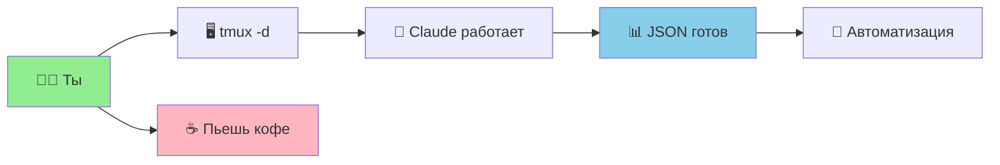

# 🚀 Claude Code + TMUX + JSON = Ultimate Automation

## 🎯 TL;DR: Почему это КРУТО



## 📊 JSON vs Plain Text

| Что | Plain Text 😢 | JSON 🚀 | Зачем тебе |
|-----|--------------|---------|------------|
| **Парсинг** | Регулярки и боль | `jq '.field'` | ✅ 1 команда вместо 100 |
| **Структура** | Хаос | Четкая схема | ✅ Всегда знаешь где что |
| **Метаданные** | Нет | cost, tokens, time | ✅ Контроль расходов |
| **Pipeline** | Сложно | Легко | ✅ `\|` и поехали |
| **Валидация** | Глазами | Автоматом | ✅ CI/CD ready |

## 🎬 3 Убойных Сценария

### 1️⃣ **Массовый Анализ Проектов**

```bash
# Запускаешь перед уходом на обед
for repo in ~/repos/*; do
    tmux new-d -s "scan-$(basename $repo)" -c "$repo" \; \
    send-keys "claude -p 'security audit' --json > security.json" C-m
done

# Возвращаешься - все готово!
jq -s '.[].vulnerabilities[]' ~/repos/*/security.json | sort -u
```

**Выгода**: 10 проектов за время 1 проекта

### 2️⃣ **CI/CD Pipeline**

```yaml
# .github/workflows/claude-review.yml
- name: Claude Review
  run: |
    claude -p "review PR changes" --output-format json > review.json
    if [ $(jq '.issues | length' review.json) -gt 0 ]; then
      jq -r '.issues[] | "::error::" + .' review.json
      exit 1
    fi
```

**Выгода**: Автоматический код-ревью на каждый PR

### 3️⃣ **Документация As Code**

```bash
# Генерация документации каждую ночь
0 3 * * * tmux new-d -s docs \; send-keys \
  "claude -p 'generate API docs' --json | \
   jq -r '.documentation' > docs/api.md && \
   git commit -am 'docs: auto-update' && git push" C-m
```

**Выгода**: Всегда актуальные доки

## 🔥 Slash Commands + JSON = 💪

### Создай `.claude/commands/mega-analyze.md`:

```markdown
---
name: mega-analyze
---

Perform comprehensive analysis:

1. Architecture review
2. Security vulnerabilities 
3. Performance bottlenecks
4. Test coverage gaps
5. Technical debt assessment

Output as JSON:
{
  "timestamp": "ISO-8601",
  "metrics": {
    "security_score": 0-10,
    "performance_score": 0-10,
    "maintainability_score": 0-10,
    "test_coverage": percentage
  },
  "critical_issues": [...],
  "recommendations": [...],
  "estimated_fix_hours": number
}
```

### Используй:

```bash
tmux new-d -s analyze \; send-keys "/mega-analyze" C-m
```

## 📈 Реальные Цифры от Сообщества

running multiple Claude instances in parallel:

- **Philipp Spiess**: "saves 1-2 days of routine work per model"
- **Anthropic Team**: "Some people at Anthropic have been racking up like thousands of dollars a day with this kind of automation"
- **Boris (Claude Code team)**: "it fixed a lot of the issues...surprisingly high to the point where I became a believer"

## 🎯 Quick Start за 3 шага

### 1. Загрузи скрипты:

```bash
chmod +x /Users/user/____Sandruk/___PARA/__Areas/_5_CAREER/DEVOPS/automations/zsh/scripts/claude-json-automation.sh
source /Users/user/____Sandruk/___PARA/__Areas/_5_CAREER/DEVOPS/automations/zsh/scripts/claude-json-automation.sh
```

### 2. Запусти анализ:

```bash
analyze_project ~/projects/hypetrain
```

### 3. Проверь результат:

```bash
# Через 5-10 минут
cat analysis-*.json | jq '.'
```

## 💡 Pro Tips

### 🔄 Параллельные агенты для сложных задач

```bash
# Агент 1: Пишет код
tmux new-d -s writer \; send-keys \
  "claude -p 'implement user auth' --json > implementation.json" C-m

# Агент 2: Ревьюит код
tmux new-d -s reviewer \; send-keys \
  "sleep 300 && claude -p 'review $(cat implementation.json | jq -r .code)' --json > review.json" C-m
```

### 📊 Dashboard в реальном времени

```bash
# Запусти мониторинг
tmux new -s dashboard \; send-keys \
  "watch -n 5 'ls -la *.json | tail -10 && echo && jq -r .status *.json 2>/dev/null | sort | uniq -c'" C-m
```

### 🎯 Batch Processing

```bash
# Обработка 100 файлов
find . -name "*.py" | parallel -j10 \
  'tmux new-d -s "fix-{#}" \; send-keys \
   "claude -p \"fix linting in {}\" --json > fixes/{#}.json" C-m'
```

## 🚨 Что дальше?

1. **Автоматизируй рутину**: Каждая повторяющаяся задача = tmux + JSON
2. **Стройй pipeline**: JSON → jq → следующий шаг
3. **Масштабируй**: 1 задача работает? Запусти 100!

## 📚 Ресурсы

- [Claude Code Best Practices](https://www.anthropic.com/engineering/claude-code-best-practices)
- [Awesome Claude Code](https://github.com/hesreallyhim/awesome-claude-code)
- [Claude Code SDK Docs](https://docs.anthropic.com/en/docs/claude-code/sdk)

---

**🔥 Bottom Line**: Almaz открыл способ превратить Claude из "помощника" в "армию роботов". JSON делает output предсказуемым, tmux делает работу параллельной, а ты пьешь кофе пока все делается само!
