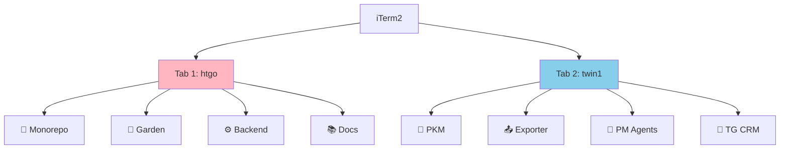
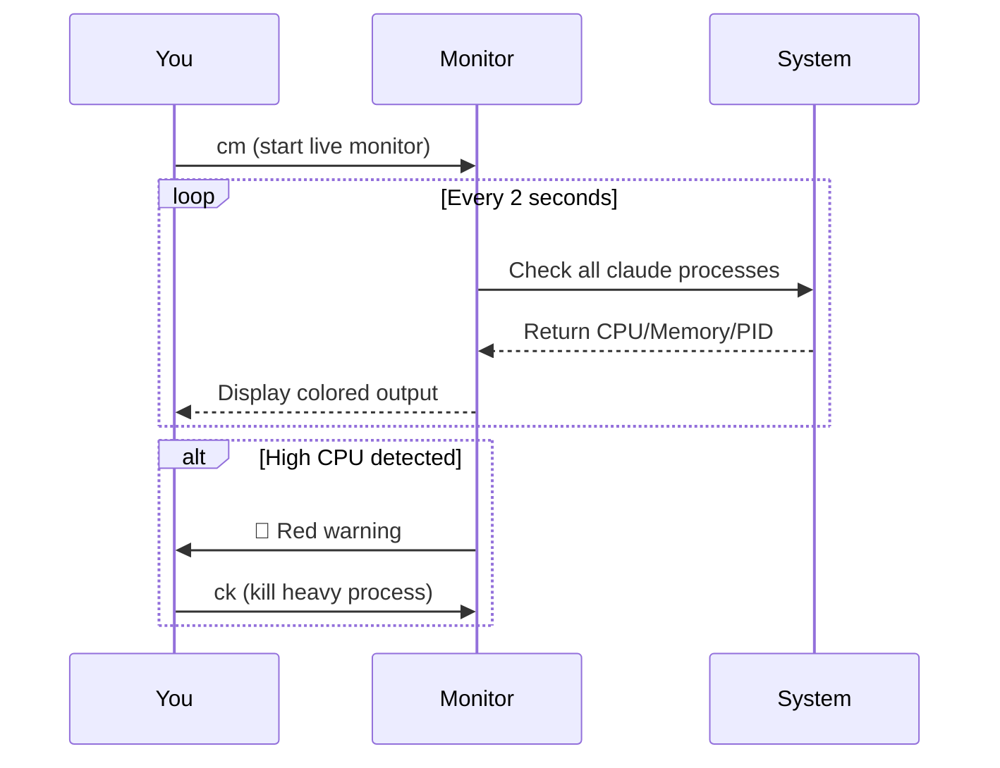

# 🎯 Claude Multi-Agent Monitoring Guide

## 📊 Your Setup: 2 Workspaces × 4 Agents = 8 Total



## 🚀 Quick Start Monitoring

### ☑️ Step 1: Load monitoring tools
```bash
source /Users/user/____Sandruk/___PARA/__Areas/_5_CAREER/DEVOPS/automations/zsh/aliases/claude-monitor-aliases.zsh
```

### ☑️ Step 2: Choose your monitoring style

| Command | What it does | When to use |
|---------|--------------|-------------|
| `cm` | 🎬 Live monitor (refreshes every 2s) | Watch real-time |
| `cs` | 📊 Quick stats | One-time check |
| `cd` | 🎨 Full dashboard | Extended monitoring |
| `csum` | 📈 Summary only | Quick overview |

## 🎬 Live Monitor View Example

```
🤖 CLAUDE AGENTS MONITOR - 10:23:45
━━━━━━━━━━━━━━━━━━━━━━━━━━━━━━━━━━━━━━━━━━━━━━━━━━
PID      WORKSPACE            CPU%   MEM%   TIME     DIRECTORY
─────────────────────────────────────────────────────────────────
12345    🚂 HypeTrain        45.2   3.4    2:34:12  HypeTrain
12346    🌱 HypeTrain        23.1   2.8    1:45:23  hypetrain-garden
12347    ⚙️ HypeTrain        67.8   4.2    3:12:45  hypetrain-backend
12348    📚 HypeTrain        12.4   2.1    0:45:12  hypetrain-docs
12349    🧠 Twin1-PKM        34.5   3.6    1:23:45  ___PKM
12350    📤 Twin1-Export     56.7   3.9    2:01:23  LLMs-claude-code
12351    🤖 Twin1-PM         23.4   2.7    1:12:34  github-project
12352    💬 Twin1-TG         45.6   3.2    1:56:78  tg-mcp-assistant

📊 SYSTEM OVERVIEW
─────────────────────────────────────────────────────────────────
🤖 Active Agents: 8
💻 Total CPU: 308.7%
🧠 Total Memory: 26.9%
🖥️ System CPU: 78%
```

## 🎨 Dashboard Layout (3 windows)

```
Window 1: Live Monitor        Window 2: System          Window 3: Logs
┌─────────────────────┐      ┌─────────────────┐      ┌──────────┬──────────┐
│ Real-time agents    │      │                 │      │ Claude   │ Stats    │
│ CPU/Memory usage    │      │     btop        │      │ logs     │ per      │
│ Workspace info      │      │   (system)      │      │ tail -f  │ workspace│
│ Auto-refresh 2s     │      │                 │      │          │          │
└─────────────────────┘      └─────────────────┘      └──────────┴──────────┘
```

## 🚨 Resource Management

### 🟢 Normal (All Good)
- CPU per agent: < 50%
- Total CPU: < 400% (M3 has 8 cores)
- Memory: < 5% per agent

### 🟡 Warning (Watch it)
- CPU per agent: 50-70%
- Total CPU: 400-600%
- Memory: 5-10% per agent

### 🔴 Critical (Take action)
- CPU per agent: > 70%
- Total CPU: > 600%
- Memory: > 10% per agent

## 🎯 Quick Actions

### When resources are high:
```bash
# 1. Check what's happening
csum    # Quick summary

# 2. If one agent is stuck
ck      # Kill agents using > 80% CPU

# 3. Emergency - kill all
ckall   # Kills ALL claude agents
```

### Monitoring workflow:


## 📊 Best Practices

1. **Start monitoring when you launch workspaces**
   ```bash
   # Terminal 1
   htgo
   
   # Terminal 2
   twin1
   
   # Terminal 3
   cm  # Monitor both
   ```

2. **Use dashboard for extended sessions**
   ```bash
   cd  # Opens full tmux dashboard
   ```

3. **Export stats before killing agents**
   ```bash
   ce  # Saves to timestamped file
   ```

4. **Set up alerts**
   ```bash
   cw 60 8  # Alert when CPU > 60% or Memory > 8%
   ```

## 🆘 Troubleshooting

| Problem | Solution |
|---------|----------|
| Can't see all agents | Make sure both workspaces are running |
| Monitor shows 0 agents | Check if claude processes are named differently |
| High CPU usage | Use `ck` to kill heavy processes |
| Monitor crashes | Just restart with `cm` |

## 💡 Pro Tips

- 🖱️ **Use mouse** to scroll in live monitor
- 📸 **Screenshot** interesting patterns for debugging
- 📊 **Export stats** regularly to track performance over time
- 🎯 **Focus on outliers** - one stuck agent can slow everything

---

**Remember**: Your M3 can handle 8 agents well, but monitor for stuck processes! 🚀
